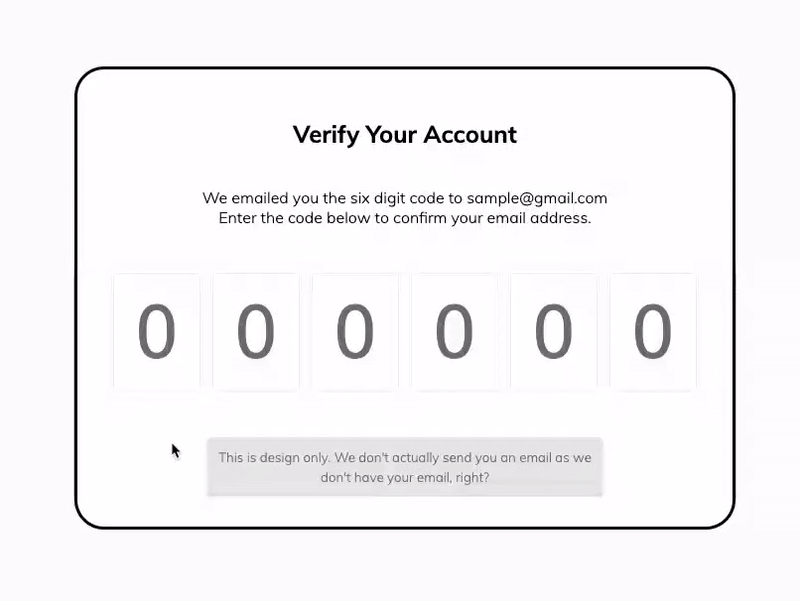

# Verify Account UI 🔥

The **Verify Account UI** project is a user interface design implemented using HTML, CSS, and JavaScript. This project provides a simulated environment for users to enter a 6-digit verification code, as if they had received it in their email. The UI is designed to be responsive and includes media queries to ensure optimal user experience across various devices and screen sizes.

[Deployed Link Here](https://iqbalahmadi.github.io/Verify-Account-UI/)  

## Features

1. **6-Digit Code Entry:** Users can enter a 6-digit verification code in a sequential manner.

2. **Digit Deletion:** Users can delete a digit by pressing the backspace button, allowing them to correct their input if needed.

3. **Automatic Jumping:** As soon as a digit is entered, the focus automatically shifts to the next input box, facilitating a seamless input process.

4. **Responsive Design:** The UI is designed to adapt to different screen sizes, ensuring consistent functionality and aesthetics across various devices, including desktops, tablets, and smartphones.

## Technologies Used

- **HTML:** The structure of the verification UI is built using HTML, with different input boxes for each digit.

- **CSS:** The styling and layout of the UI are defined using CSS. Media queries are also utilized to make the UI responsive.

- **JavaScript:** The dynamic behavior of the UI, including automatic focus shifting and digit deletion, is implemented using JavaScript.

## Usage

To use the Verify Account UI, follow these steps:

1. Clone or download this repository to your local machine.
2. Open the `index.html` file in a web browser of your choice.
3. You will see six input boxes, each representing a digit of the verification code.
4. Click on the input boxes one by one and enter the 6-digit verification code. As you enter each digit, the focus will automatically shift to the next input box.
5. If you make a mistake, you can press the backspace button to delete a digit and enter another.
6. Once you have entered all six digits, you can proceed with your simulated verification process.

## Contributing

This project is intended as a design showcase and a learning resource. If you would like to contribute, you can fork the repository, make changes, and submit a pull request. However, please note that this project focuses on the front-end design and behavior, and significant changes to the core functionality are beyond its scope.
